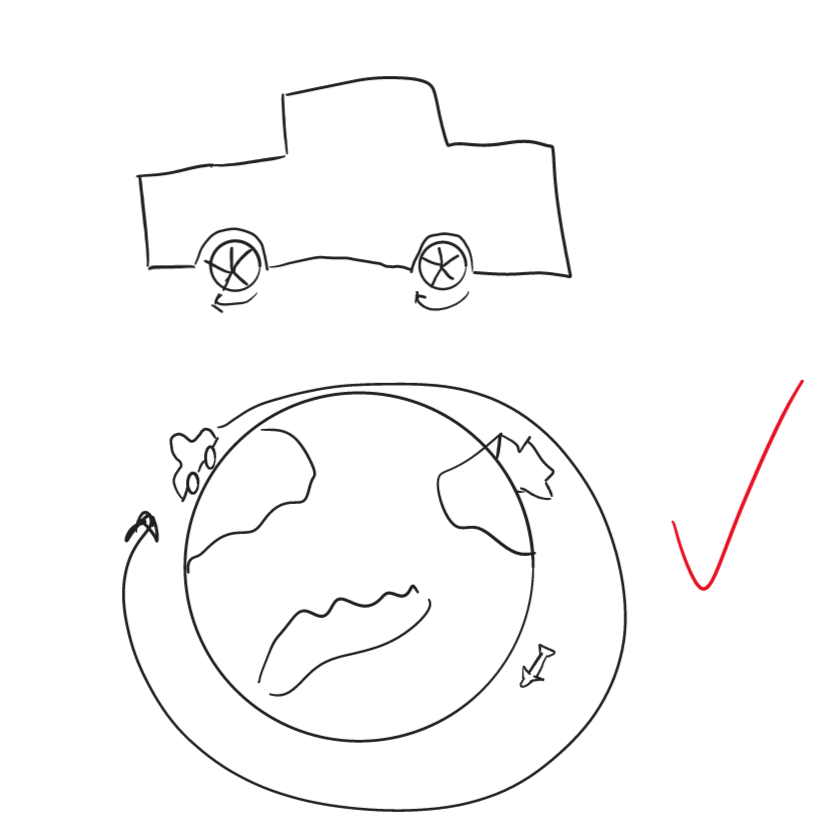

# Portfolio des Moduls 152

Link zum Portfolio : https://leandrocarvalho200409.github.io/m152_portfolio/

## Lernjournal Videoclip  
***Siehe Abgabe Teams***

## Lernjournal Bildergallerie  

**26/10/2022**
| Eintrag | Inhalt |
|-----------------|----------------|
| *Verwendete Zeit* | 2 Lektionen |
| *Behandelte Themen* | Suchen von Ideen für die Webseite (Bildergallerie); Erstellung einer einfachen Planung (Zeichnung) |
| *Erreichte Kompetenzen und notwendiges Wissen* | Bessere Planungskompetenz (Technologie eruieren, Ideen sammeln) |
| *Gemachte Erfahrungen* | Ich habe herausgefunden, dass man mithilfe von React und Bootstrap sehr einfach eine Slideshow für die Bildergallerie erstellen kann. |
| *Standortbestimmung und Selbsteinschätzung* | Wir haben erst mit dem Projekt angefangen und daher kann ich noch schlecht einschätzen, ob ich den Zeitplan gut einhalten kann. |
| *Planung, nächste Schritte* | Als nächstes muss ich mich mit React und Bootstrap ein wenig bekannter machen. |

**2/11/2022**
| Eintrag | Inhalt |
|-----------------|----------------|
| *Verwendete Zeit* | 2 Lektionen |
| *Behandelte Themen* | Verbessern meiner Kenntnisse in React und Bootstrap; Start der Umsetzung |
| *Erreichte Kompetenzen und notwendiges Wissen* | Ich habe gelernt, wie einfach es ist, mithilfe von React eine Applikation mit funktionalen Komponenten zu erstellen, denn bis anhin hatten wir in der Schule nur die objektorientierte Version angeschaut. Ebenfalls habe ich gelernt, dass man mit hilfe von Bootstrap sehr einfach einen Carousel (Slideshow) erstellen kann. (Kenntnisse vor allem von W3Schools und YouTube) |
| *Gemachte Erfahrungen* | Die Erfahrung, die ich gemacht habe, ist, dass ich, da ich gemerkt habe, dass React noch recht einfach sein kann, meine Meinung zu React ändern konnte. Am Anfang mochte ich React nicht so wirklich, jedoch hat sich meine Perspektive geändert. |
| *Standortbestimmung und Selbsteinschätzung* | Die Webseite sieht noch recht simpel aus, jedoch habe ich schon eine Grundstruktur erstellt und deshalb glaube ich, den Zeitplan noch recht gut einhalten zu können. |
| *Planung, nächste Schritte* | Webseite weiter entwickeln und Bilder suchen, bzw. , falls nötig, erstellen. |

**9/11/2022**
| Eintrag | Inhalt |
|-----------------|----------------|
| *Verwendete Zeit* | 2 Lektionen |
| *Behandelte Themen* | Designen der Webseite, Fix eines Problemes mit React-Router-Dom |
| *Erreichte Kompetenzen und notwendiges Wissen* | Ich habe gelernt, wie man auch mit funktionalen Komponenten in React den Router einfügen kann. Ebenfalls habe ich meine Designkompetenzen verbessert. |
| *Gemachte Erfahrungen* | Die Erfahrung, welche ich gemacht habe, ist, dass die Umsetzung eines Routers mit den funktionalen Komponenten in React ein wenig anders aussehen kann, und, dass es daher manchmal ein wenig schwierig sein kann. |
| *Standortbestimmung und Selbsteinschätzung* | Ich habe heute auch schon die Navbar für meine Portfoliowebseite zum Laufen gebracht, sodass ich nächstes Mal einfach die Slideshow ein wenig ausbessern kann. Deshalb glaube ich auf einem guten Weg zu sein. |
| *Planung, nächste Schritte* | Slideshow ausbessern und Bilder suchen, oder machen. |

**16/11/2022**
| Eintrag | Inhalt |
|-----------------|----------------|
| *Verwendete Zeit* | 2 Lektionen |
| *Behandelte Themen* | Suchen von Bilder für die Webseite auf Unsplash und Verbesserung der Slideshow |
| *Erreichte Kompetenzen und notwendiges Wissen* | Verbesserte Recherchekompetenz, sowie bessere Kenntnisse im Umgang mit Bootstrap. |
| *Gemachte Erfahrungen* | Ich habe herausgefunden, dass der Gebrauch von der Caroussel Komponente von Bootstrap recht einfach ist und ich dies auch für die Zukunft gebrauchen kann. |
| *Standortbestimmung und Selbsteinschätzung* | Ich glaube, dass mein Plan mit dem vorgegebenen Zeitplan kompatibel sein sollte und, dass dies für mich keine Problematik darstellen sollte. |
| *Planung, nächste Schritte* | Als nächstes muss ich die Bilder und Texte einfügen, sowie selber noch Bilder erstellen. |

**23/11/2022**
| Eintrag | Inhalt |
|-----------------|----------------|
| *Verwendete Zeit* | 2 Lektionen |
| *Behandelte Themen* | Suchen von Ideen für Bilder, Auseinandersetzung mit Datenschutz, Anpassung des Designs der Webseite |
| *Erreichte Kompetenzen und notwendiges Wissen* | Verbesserung von meinen Designkompetenzen, Ideen gefunden für die Bilder, welche ich selber erstellen könnte |
| *Gemachte Erfahrungen* | Ich habe herausgefunden, dass es schwierig einzuschätzen ist, welche Bildmaterialien man selber erstellen kann. |
| *Standortbestimmung und Selbsteinschätzung* | Zeitlich stehe ich mit der Abgabefrist gut dran und sollte zu keinen Schwierigkeiten kommen. Ebenfalls sieht meine Bildergallerie auch schon recht ansprechend aus und am Design werde ich nur noch wenig machen müssen. |
| *Planung, nächste Schritte* | Die letzten notwendigen Bilder erstellen und das Textmaterial zu den Bilder verfassen |

**30/11/2022**
| Eintrag | Inhalt |
|-----------------|----------------|
| *Verwendete Zeit* | 2 Lektionen |
| *Behandelte Themen* | Anpassung des Designs der Webseite; Einfügen von selbstgemachten Bildern und Verfassung von Texten |
| *Erreichte Kompetenzen und notwendiges Wissen* | Ich habe meine Verfassungskompetenzen von Texten für sachliche Thematiken verbessert. Ebenfalls habe ich meine Kompetenzen für die Anpassung von Bildern für das Web verbessert. |
| *Gemachte Erfahrungen* | Ich habe herausgefunden, dass es noch schwierig sein kann, ein Bild für das Web zu optimieren. Ebenfalls habe ich heute gemerkt, dass mir das Design der Webseite nicht mehr so anspricht. |
| *Standortbestimmung und Selbsteinschätzung* | Ich sollte es bis nächstes Mal schaffen, dieses Projekt fertig zu gestalten. |
| *Planung, nächste Schritte* | Noch mehr Bilder erstellen und einbinden. |

**7/12/2022**
| Eintrag | Inhalt |
|-----------------|----------------|
| *Verwendete Zeit* | 2 Lektionen |
| *Behandelte Themen* | Problem mit Github Pages gelöst; Mehr Bilder erstellt und eingebunden; Mich mit der Theorie zu den Bildern auseinander gesetzt |
| *Erreichte Kompetenzen und notwendiges Wissen* | Ich habe herausgefunden, dass mein einziges Problem mit dem Deployment auf Github Pages war, dass ich mein Projekt auf OneDrive hatte und dies wahrscheinlich das Problem war. Dieses Problem konnte ich mithilfe von Herrn Cavuoti lösen. Ebenfalls habe ich meine Kompetenzen im Erstellen vun Bildmaterialien verbessert. |
| *Gemachte Erfahrungen* | Ich habe herausgefunden, dass der Speicherort der Projekte einen grossen Einfluss auf dessen Funktionalität haben kann und, dass solche einfache Fehler manchmal recht verzweifelnd sein können. |
| *Standortbestimmung und Selbsteinschätzung* | Ich bin mit meinem Projekt fertig, da ich es fertig programmiert habe und es auch deployed habe. Das Projekt ist recht gut gelaufen, obwohl ich einige Hürden aufgefunden habe. |
| *Planung, nächste Schritte* | **KEINE** |

Theoretische Erkenntnisse
- Verschiedene Arten von Gallerien
   - **Slideshow (Carousel)**
      - Vorteile: User Kann angezeigtes Bild selbst wählen; Gut für "storytelling"; User kann Controls gebrauchen; Bilder können als eine Art Show automatisch abgespielt werden; Text kann einfach hinzugefügt werden
      - Nachteile: Nur ein Bild kann gleichzeitig angezeigt werden; Automatisches Laufen kann nervig sein
   - Galerie
      - Vorteile: Alle Bilder können gleichzeitig angezeigt werden; Anordnung kann einfach ausgewählt werden; keine zusätzlichen Packages oder ähnliches nötig
      - Nachteile: Wenig Bedienung des Users
- Bildformate (Vor- & Nachteile)
  - JPG (JPEG):
      - Vorteile: Hohe Farbtiefe; Rastergraphik; von allen OSs unterstützt; gutes Verhältnis zwischen Kompression und Qualität.
      - Nachteile: Verlustbehaftete Komprimierung; Nicht geeignet für Logos, ikonische Grafiken, ... wegen dem Kompressionsalgorithmus; unterstützt keine Animation
  - GIF:
      - Vorteile: Verlustfreie Komprimierung; geeignet für Logos, Banner, **Animationen**; Einsatz von Transparenz möglich; geringe Dateigrösse.
      - Nachteile: tiefe Farbtiefe; nicht geeignet für Fotos oder Grafiken mit detaillierten Farbverläufen.
  - PNG:
    - Entwickelt um GIF zu ersetzen.
      - Vorteile: Hybrid aus JPG und GIF; Farbtiefe von 8 Bit - 24 Bit; Gebrauch von Transparenz möglich; verlustfrei; geeignet für kleinere Bilder, Grafiken oder Formen; bessere Qualität als JPG
      - Nachteile: verlustfreies Format nicht so stark und flexibel, wie bei JPG; 
  
  - SVG:
      - Vorteile: zweidimensionale **Vektorgrafik**; verlustfreie Komprimierung und Skalierung; geringe Dateigrösse; gut für responsive Webseiten; gut für Logos; Möglichkeit der Animation mittels JavaScript.
      - Nachteile: Nicht geeignet für detailreiche Bilder oder Fotos
      
## Lernjournal Animation

### Planung

### Storyboard

### Vorgehen

**14/12/2022**
| Eintrag | Inhalt |
|-----------------|----------------|
| *Verwendete Zeit* | 2 Lektionen |
| *Behandelte Themen* | Planung der Animation; Erstellen eines Storyboards |
| *Erreichte Kompetenzen und notwendiges Wissen* | Ich habe mir anhand von anderen Animationen Inspiration für meine eigene geholt, welche irgendwie etwas mit dem Thema der Mobilität zu tun haben soll. Ebenfalls habe ich einen kleinen Storyboard für meine Animation erstellt. |
| *Gemachte Erfahrungen* | Ich habe gesehen, was für verschiedene Arten von Animationen existieren und welche für mich in Frage kämen. |
| *Standortbestimmung und Selbsteinschätzung* | Ich konnte einen grossen Teil der Planung bereits gut machen und habe schon zwei verschiedene Animationen, welche für mich in Frage kommen. |
| *Planung, nächste Schritte* | Ich habe einen grossen Teil der Planung bereits machen können und nächstes Mal muss ich mich nur noch für eine Art Animation entscheiden und diese erstellen. |

**21/12/2022**
| Eintrag | Inhalt |
|-----------------|----------------|
| *Verwendete Zeit* | 2 Lektionen |
| *Behandelte Themen* | Entscheidung für eine Art Animation; Angefangen mit der Umsetzung; Gelernt, wie man Adobe Illustrator und Animate gebraucht |
| *Erreichte Kompetenzen und notwendiges Wissen* | Ich habe angefangen zu lernen, wie man Adobe Illustrator gebraucht und habe eine erste Figur erstellt. Das notwendige Wissen dafür habe ich mir von Internet beschafft. |
| *Gemachte Erfahrungen* | Ich habe die Erfahrung gemacht, dass es eigentlich nicht so schwierig ist eine Animation zu erstellen, wenn man die richtige Software dafür gebraucht. |
| *Standortbestimmung und Selbsteinschätzung* | Ich bin schon recht weit mit der Animation und ich glaube, dass ich auf einem guten Weg bin und, dass ich über die Ferien sicher mit dem Projekt fertig werde. |
| *Planung, nächste Schritte* | Ich muss jetzt über den Ferien versuchen die Animation fertig zu machen und inkl. dem Video ins Portfolio einbinden. |

**11/1/2023**
| Eintrag | Inhalt |
|-----------------|----------------|
| *Verwendete Zeit* | 2 Lektionen + Zeit über die Ferien |
| *Behandelte Themen* | Animation fertig gemacht; Animation und Video in die Webseite eingebunden |
| *Erreichte Kompetenzen und notwendiges Wissen* | Ich habe gelernt wie man mit Adobe Animate eine Animation erstellt und wie man diese und Videos in eine Webseite einbinden kann. |
| *Gemachte Erfahrungen* | Ich habe herausgefunden, dass dieses Projekt recht einfach lösbar war und auf welche Arten man eine Animation einbinden kann. |
| *Standortbestimmung und Selbsteinschätzung* | Ich bin mit meinem Projekt fertig, da ich es fertig umgesetzt habe und auch alles schön eingebunden und deployed habe. |
| *Planung, nächste Schritte* | **KEINE** |
